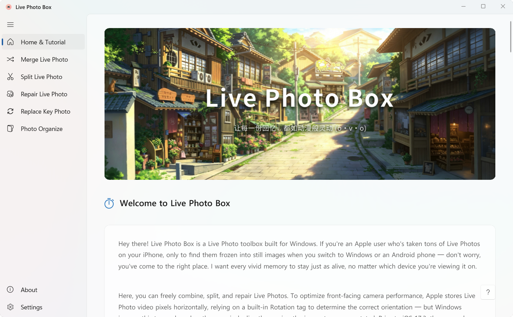
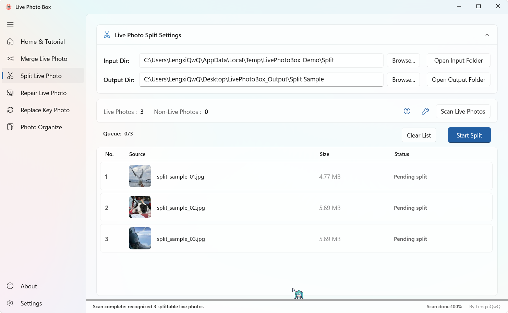
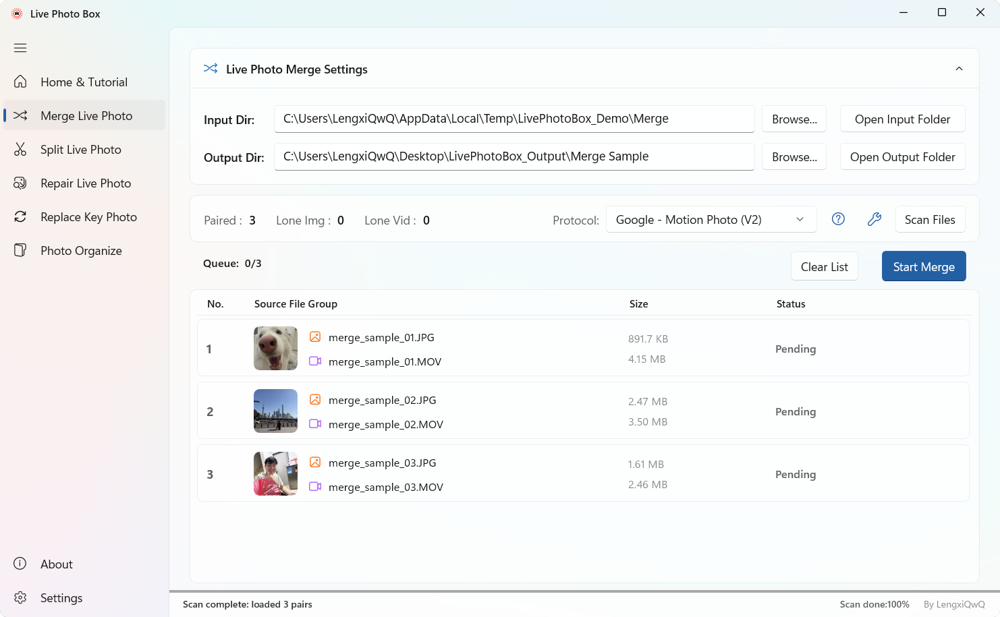
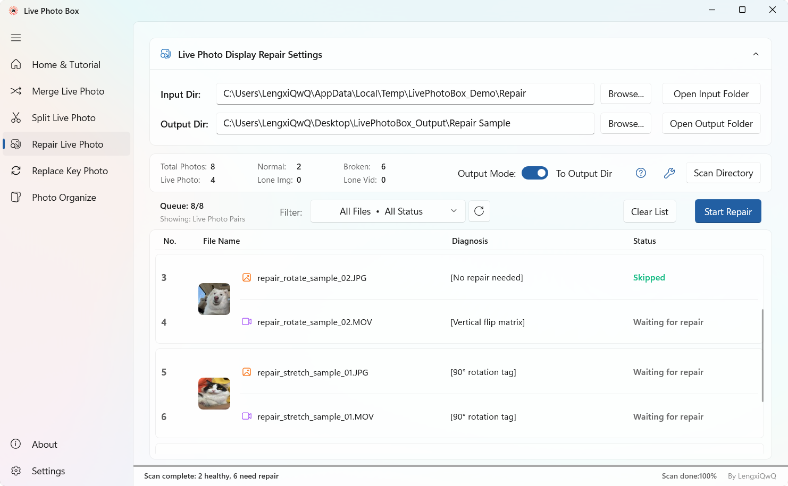
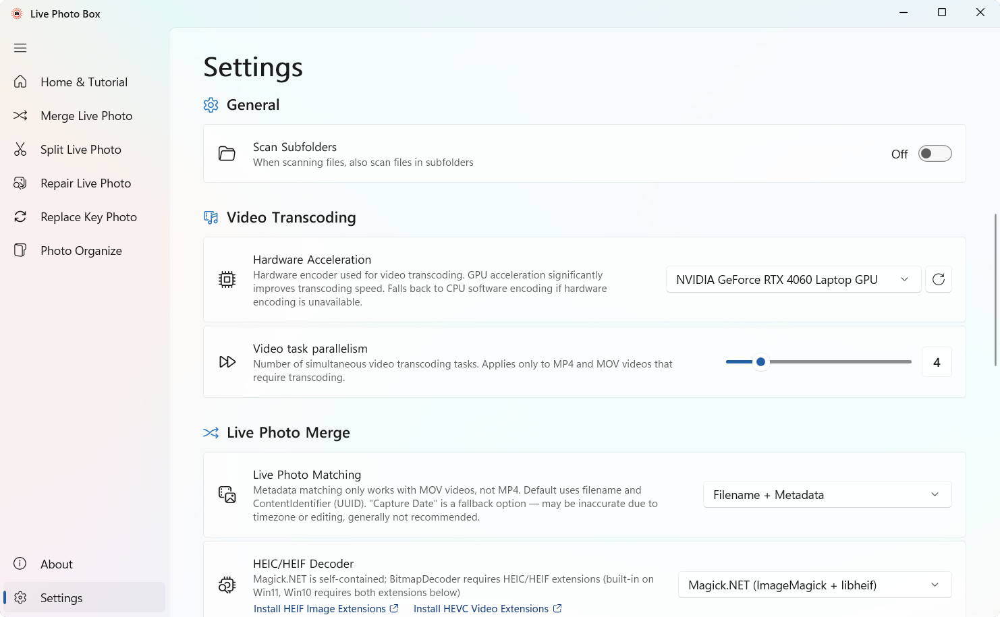
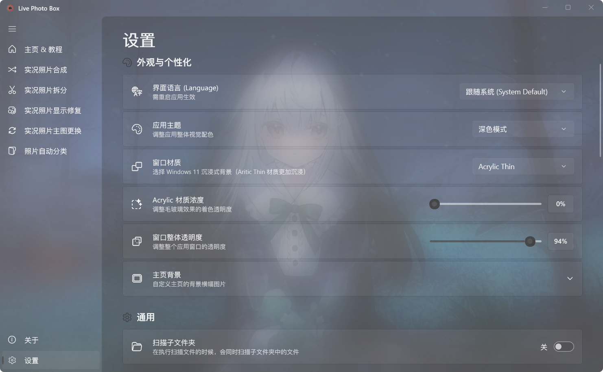

<div align="center">

<h1>
  
  Live Photo Box
</h1>
<p><em>Display and process Apple Live Photos directly on Windows &amp; android .</em></p>

<p>
  🌐 Language: &nbsp;<strong>English (en)  &nbsp;·&nbsp; <a href="README.zh-cn.md">简体中文 (zh-cn)</a></strong>
</p>

</div>

<p align="center">
  <a href="https://github.com/lengxiqwq/live-photo-box/releases"></a>
  <a href="https://github.com/lengxiqwq/live-photo-box/actions"></a>
  
  
  
  
  
</p>

---

## 💡 What Is This?

iPhone Live Photos are essentially a still image + a short video clip. The problem is that Apple's format doesn't play well with Windows:

- **No native preview** — Windows File Explorer only shows a static image
- **Metadata loss & pairing corruption** after cross-platform transfers (e.g. iOS → Android → back), turning Live Photos into plain JPEGs
- **Front-camera videos appear rotated or stretched** — Windows ignores the rotation metadata that iOS uses to correct orientation

**Live Photo Box** solves all these problems — letting you view, manage, and repair Live Photos on Windows just like on an iPhone.

Built on **WinUI 3 (Windows App SDK 1.8)**, fully native to Windows 11 Fluent Design guidelines, with Mica / Acrylic materials and dark/light theme support.

---

## 🚀 Download

<div align="center">
  <a href="#"></a><a href="https://github.com/lengxiqwq/live-photo-box/releases"></a>
</div>
<p align="center">
  <sub>
    Architecture: <b>x64</b>
    &nbsp;|&nbsp;
    System Requirements: <b>Windows 10 (1809+)</b> or <b>Windows 11</b>
    &nbsp;|&nbsp;
    No runtime required (self-contained .NET 9 + WinAppSDK 1.8)
  </sub>
</p>


---

## ✨ Core Features

### 🔗 Merge Live Photo

Combine any still image + video clip into a standard Live Photo, compatible with multiple Android protocols.

- Supports **Google — Micro Video (V1) / Motion Photo (V2) / OPPO/OnePlus — O Live Photo** protocols
- Automatically writes complete `EXIF` + `QuickTime` metadata (`ContentIdentifier` `UUID`)
- **Smart pairing engine**: matches photo-video pairs by filename, Apple `ContentIdentifier` (`UUID`), falls back to capture-time tolerance when neither matches
- **Live Photos merged via any supported protocol are fully viewable on Windows**

### 📸 Split Live Photo

Split a single-file Live Photo back into independent still image (`JPG` / `HEIC`) and video (`MOV` / `MP4`).

- Smart removal of Google `XMP` metadata to prevent re-identification as a Live Photo after splitting
- Rebuilds `JPEG` segment-by-segment, preserving `EXIF` / `ICC` / `GPS` / shooting parameters

### 🛠️ Repair Live Photo

Deep repair of display issues on iPhone Live Photos exported to Windows.

- **Excess thumbnail & horizontal stretch** (pre-iOS 17.3): lossless fix via `jpegtran` rotation + thumbnail stripping
- **Front-camera video rotation**: re-encode via `FFmpeg` to bake the rotation matrix into pixels
- **HEIC orientation fix**: corrects miswritten `Orientation` tags
- **ContentIdentifier restoration**: auto-repair photo-video `UUID` pairing
- Scan and view **diagnostic details** for each photo, filter by file type or repair status

### 🖼️ Replace Key Photo (In Development)

Freely change the cover frame of a Live Photo — pick the perfect moment from the motion video and losslessly swap it in.

### 📂 Photo Organize (In Development)

Automatically scan, categorize, and archive by device, date, and Live Photo type.

---

## 📋 Supported Live Photo Protocols

| Protocol | Source | Description |
|----------|--------|-------------|
| Google — Micro Video (V1) | Google (legacy) | `MP4` video appended to `JPEG` end, offset in `GCamera:MicroVideoOffset`. Used by older Xiaomi MIUI / Pixel devices |
| Google — Motion Photo (V2) | Google | Modern standard, `Container:Directory` `XMP` structure. Used by Google Pixel / Xiaomi HyperOS 3+ |
| OPPO/OnePlus — O Live Photo | OPPO / OnePlus | Extended `Motion Photo V2`, adds `OpCamera` namespace + `EXIF` `UserComment`. Used by OPPO ColorOS / OnePlus OxygenOS |

> ⚡ **Live Photos merged via any supported protocol are fully viewable on Windows 11.**

---

## 📸 Screenshots

<table align="center">
<tr>
  <td align="center"><b>🏠 Home & Tutorial</b><br></td>
  <td align="center"><b>📸 Split Live Photo</b><br></td>
</tr>
<tr>
  <td align="center"><b>🔗 Merge Live Photo</b><br></td>
  <td align="center"><b>🛠️ Repair Live Photo</b><br></td>
</tr>
<tr>
  <td align="center"><b>⚙️ Settings</b><br></td>
  <td align="center"><b>✨ Acrylic Semi-Transparent Effect</b><br></td>
</tr>
</table>

---

## 🛠️ Tech Stack

| Layer | Technology | Version |
|-------|-----------|---------|
| Language | C# | 13.0 |
| Runtime | .NET | 9.0 |
| UI Framework | Windows App SDK (WinUI 3) | 1.8 |
| Architecture | MVVM (CommunityToolkit.Mvvm) | 8.4.2 |
| Image Processing | Magick.NET (ImageMagick) + Win2D | 14.14.0 / 1.3.2 |
| Metadata Engine | `ExifTool` (daemon mode, v13.x) | — |
| Video Processing | `FFmpeg` (NVENC / QSV / AMF hardware acceleration) | — |
| JPEG Operations | `jpegtran` (lossless rotation, thumbnail stripping) | — |
| UI Extensions | CommunityToolkit.WinUI + FluentIcons | — |
| Packaging | MSIX self-contained (no runtime required) | — |

---

## 💻 Build & Development

### Prerequisites

- [Visual Studio 2022](https://visualstudio.microsoft.com/) or later
- In VS Installer, select: **.NET desktop development** + **Universal Windows Platform development** (includes Windows App SDK components)
- [.NET 9 SDK](https://dotnet.microsoft.com/download/dotnet/9.0)

### Build

```bash
# Clone the repository
git clone https://github.com/lengxiqwq/live-photo-box.git
cd live-photo-box

# Restore NuGet packages
dotnet restore

# Build the project
dotnet build "Live Photo Box/Live Photo Box.csproj"

# Run
dotnet run --project "Live Photo Box/Live Photo Box.csproj"
```

---

## 📁 Project Structure

```
live-photo-box/
├── Live Photo Box/              # Main project (WinUI 3 MSIX app)
│   ├── Assets/                # Icons, screenshots, static resources
│   ├── Controls/              # Custom controls (fullscreen lightbox, status bar)
│   ├── Converters/            # XAML value converters
│   ├── Helpers/               # Utilities (scrolling, formatting, hover preview, etc.)
│   ├── Models/                # Data models
│   ├── Services/              # Business logic layer
│   │   └── Protocols/         # Live Photo protocol implementations (3 types)
│   ├── Strings/               # Multilingual resources (zh-Hans / en-US)
│   ├── ViewModels/            # MVVM ViewModel layer
│   └── Views/                 # XAML pages
├── docs/                      # Project documentation
├── changelogs/                # Release notes
├── scripts/                   # Build & packaging scripts
└── README.md
```

> 📖 See [`docs/LivePhotoBox-ProjectOverview.md`](docs/LivePhotoBox-ProjectOverview.md) for the complete directory reference.

---

## 🌍 Localization

| Language | Status |
|----------|:------:|
| 中文（简体）(zh-Hans) | ✅ Complete |
| English (en) | ✅ Complete |

Follows system language automatically; can also be switched manually in Settings.

---

## 🤝 Contributing

Issues and Pull Requests are welcome!

- 🐛 **Bug reports** and 💡 **Feature requests** → [GitHub Issues](https://github.com/lengxiqwq/live-photo-box/issues)
- 🔧 **Code contributions** → Fork → Feature Branch → Pull Request

### Guidelines

- UI text should use RESW resource files, not hardcoded strings
- Follow the project's MVVM layering conventions
- Add multi-line comments at the top of each file describing its purpose

---

## 📄 License

This project is open-source under the **GNU General Public License v3.0 (GPL 3.0)**. See the [LICENSE](LICENSE) file for details.

---

## 🙏 Credits

| Tool / Library | Purpose | License |
|---------------|---------|---------|
| [ExifTool](https://exiftool.org/) by Phil Harvey | Global metadata parsing, injection, XMP reconstruction | Perl |
| [FFmpeg](https://ffmpeg.org/) | Video transcoding and stream remuxing | LGPL/GPL |
| [jpegtran](https://jpegclub.org/) | Lossless JPEG transforms (DCT coefficient space) | Free software |
| [Magick.NET](https://github.com/dlemstra/Magick.NET) by dlemstra | HEIC/HEIF decoding via libheif | Apache 2.0 |
| [CommunityToolkit.Mvvm](https://github.com/CommunityToolkit/dotnet) | MVVM framework | MIT |
| [Win2D](https://github.com/microsoft/Win2D) | GPU-accelerated graphics | MIT |
| [FluentIcons](https://github.com/davidxuang/FluentIcons) | Fluent icon set | MIT |

---

<p align="center">
  <sub>Made with ❤️ by <a href="https://github.com/lengxiqwq">LengxiQwQ</a></sub>
</p>

<p align="center">
  <a href="https://github.com/lengxiqwq/live-photo-box/stargazers"></a>
  <a href="https://github.com/lengxiqwq/live-photo-box/network/members"></a>
</p>
